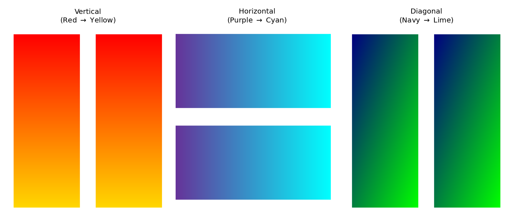

# mpl-gradients

[](https://badge.fury.io/py/mpl-gradients)


A lightweight, zero-dependency library to add linear gradient fills to Matplotlib charts.
*Solves [matplotlib/matplotlib#30958](https://github.com/matplotlib/matplotlib/issues/30958).*

## Features
* **Vertical Gradients:** Fade from Top to Bottom.
* **Horizontal Gradients:** Fade from Left to Right.
* **Diagonal Gradients:** Fade from Corner to Corner.
* **Alpha Blending:** Correctly handles transparency.

## Installation

You can install directly from GitHub:

```bash
pip install mpl-gradients
```

## Quick start 
```python
import matplotlib.pyplot as plt
from mpl_gradients import LinearGradient

fig, ax = plt.subplots()
ax.bar([0, 1, 2], [10, 20, 15])

# Create a gradient (Top-Left Navy -> Bottom-Right Lime)
gradient = LinearGradient("navy", "lime", direction="diagonal")

# Apply to bars
for bar in ax.containers[0]:
    bar.set_agg_filter(gradient)

plt.show()
```
## Requirements
Python 3.9+

Matplotlib

Numpy
